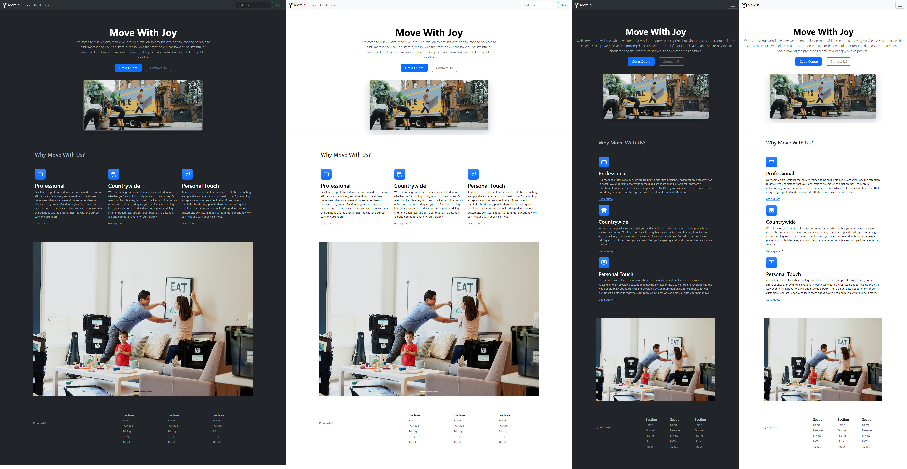
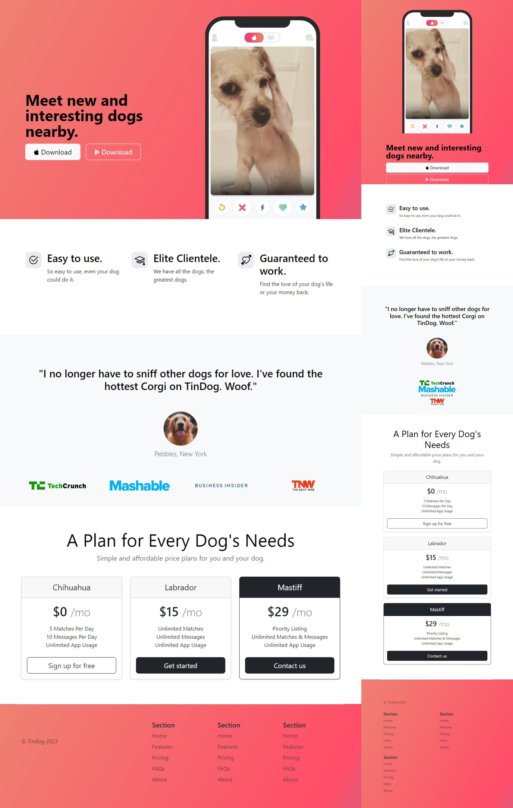
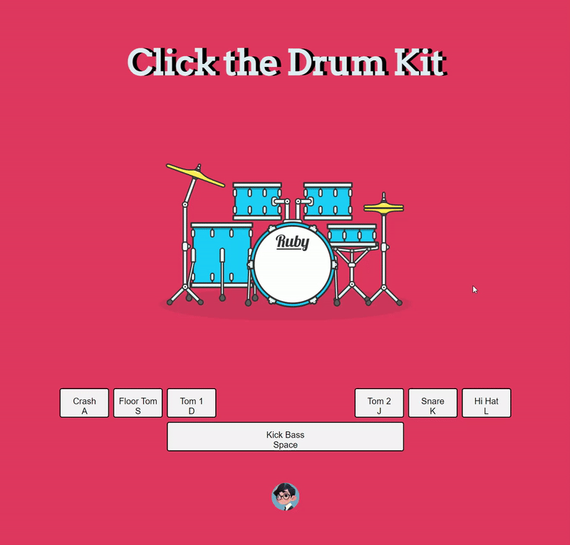
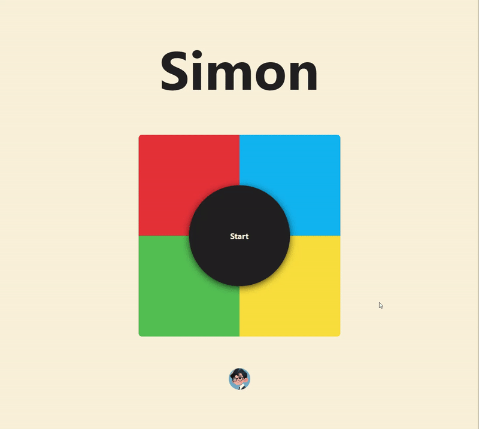

# Web Development Projects  
Here is my journey of learning front-end web development following [Udemy 2023 Web Development Bootcamp](https://www.udemy.com/course/the-complete-web-development-bootcamp/), all projects are tutorial based and for learning purposes, each project will have its own repo for hosting and demostration purposes.
___
## Day 11 Project: Move-it
Build a fully reseponsive frontpage for Move-it, a fictious moving startup in San Francisco.  
[SEE IT LIVE HERE.](https://jaycka.github.io/move-it/)  
**Concepts and skills used in this project:**   
`html` | `css` | `bootstrap`  

**Screenshot**  
  
___  

## Day 11 Project: TinDog  
Build a fully reseponsive frontpage for the app TinDog- Tindor for Dogs!  
[SEE IT LIVE HERE.](https://jaycka.github.io/tindog/)  
**Concepts and skills used in this project:**   
`html` | `css` | `bootstrap`  

**Screenshot**  
  
___  

## Day17 Project: Dicee-it
Project for Day 17 of Udemy 2023 Web Development Bootcamp: A stylish, fully interactive, fully responsive, fun dice game website that help you and your friends settling things out!  
[SEE IT LIVE HERE.](https://jaycka.github.io/dicee-it/)  
**Concepts and skills used in this project:**  
`HTML` | `CSS` | `JavaScript` | `Bootstrap` | `FLEX` | `GRID`

**Features:**  
* Roll the dice and settle the arguments;
* User name input real time display;  
* Add / Remove players, support 2~6 players;
* Gradient decent background;
* See the results at a glance with neumorphic styles;  

**Demo**  
  
___  

## Day18 Project: Drum-it  
Project for Day 18 of Udemy 2023 Web Development Bootcamp: A simple, fully responsive, fully interactive, fun drum set webset where you can hear different drum kit! Play it by either press the physical keyboard or click on-screen keys or simply click on the different part of drum image!  
[SEE IT LIVE HERE.](https://jaycka.github.io/drum-it/)  
**Concepts and skills used in this project:**  
`HTML` | `CSS` | `JavaScript` | `DOM` | `EventListener`  

**Features:**  
* Listen to physical keyboard press;
* Listen to on-screen key clicks;  
* Listen to on-screen key clicks on different part of drum images;
* Play sound accordingly;  

**Demo**  
  
___  

# Project: Simon-game
Project for Day 20 of Udemy 2023 Web Development Bootcamp: Simon game, a clasic yet popular memory board game, written in `HTML`+`CSS`+`Javascript`. It's simple, fully responsive, fully interactive, and fun-to-play. Click start to start the game, try to memorize the order or sounds of flashing piece, and play them out with the same order within the count down!  
[SEE IT LIVE HERE.](https://jaycka.github.io/simon-game/)  
**Concepts and skills used in this project:**  
`HTML` | `CSS` | `JavaScript` | `jQuery` | `DOM` | `EventListener`

**Features:**  
* Real-time click sound and effect
* Count down time depends on level
* Cool spinning status wheel

**Demo**  

